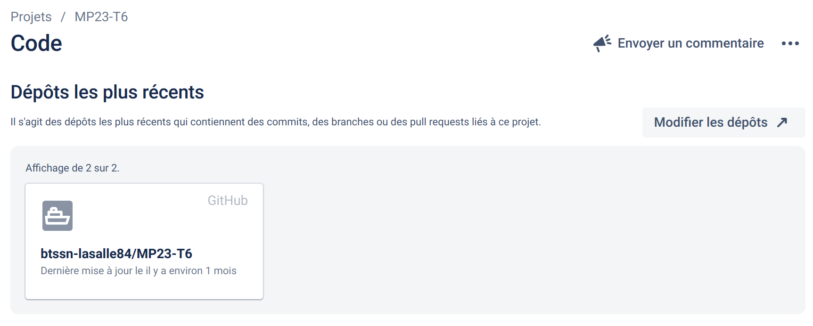
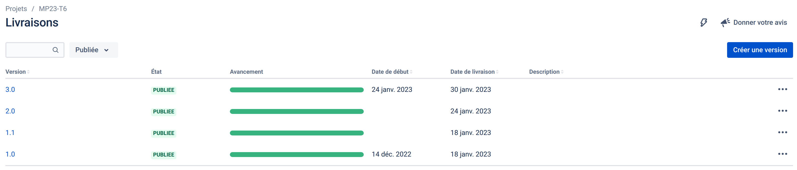
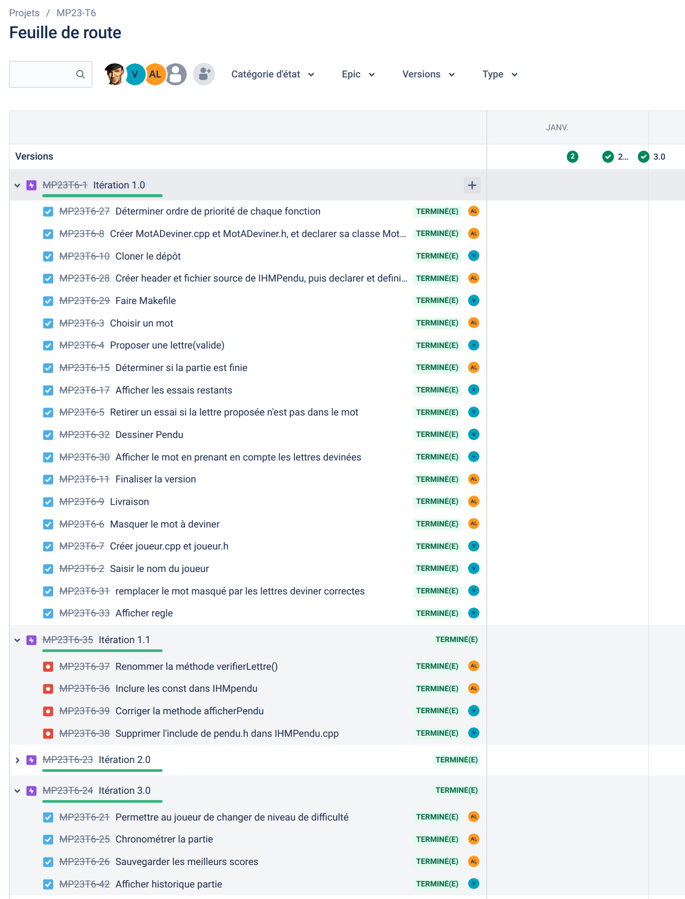

 

# Mini-projet : Jeu du pendu

## Description

Le pendu est un jeu consistant à trouver un mot en devinant quelles sont les lettres qui le composent. Le jeu se joue traditionnellement à deux, avec un papier et un crayon, selon un déroulement bien particulier.

Quand le dessin est terminé on voit un bonhomme allumette qui se pend. L’origine du jeu du pendu est inconnue. En Grande-Bretagne, il semble avoir fait son apparition pendant l’époque victorienne, vers la fin du XIXe siècle.

---

> Ceci est un mini-projet de 2 étudiants de BTS SN option Informatique & Réseaux développé en C++. L'objectif était la mise en oeuvre d'une méthode agile [Kanban](https://fr.wikipedia.org/wiki/Kanban_(d%C3%A9veloppement)) avec les outils **Jira / Github** et en appliquant le _workflow_ [Gitflow](https://btssn-lasalle84.github.io/guides-developpement-logiciel/jira.html#ancre-gitflow). L'application devait être limitée à une interface en ligne de commande (console).

---

## Jira

Intégration avec Github :

### Les versions

### Feuille de route

## Recette

|Fonctionnalité                      |Oui|Non|
|------------------------------------|:-:|:-:|
|Saisir le nom du joueur             | X |   |
|Jouer une partie                    | X |   |
|Afficher le déroulement d’une partie| X |   |
|Afficher le menu                    | X |   |
|Choisir Theme                       | X |   |

## Liste des choses à faire

- [ ] `Joueur::choisirDifficulté()` : permettre à l'utilisateur de choisir une niveau de difficulté
- [ ] `Joueur::chronometrer()` : chronométrer la partie
- [ ] `Joueur::sauvegarderRecords()` : sauvegarder les meilleurs scores

## Auteurs

- Alexis Vaillen <<alexis.vaillen@gmail.com>>
- Axel Lapierre  <<lapierre.axel30@gmail.com>>

---
©️ BTS SNIR LaSalle Avignon 2023
